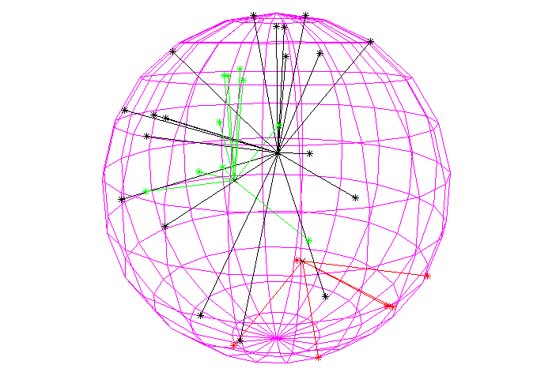

# Simple Photon Event Visualisation 
A very simple program to practice writing in C++ and compiling ROOT macros. 

I created a 3D visualisation of events within a spherical volume (keeping the SNO+ detector in mind...). 

The macro __sphere.cpp__ is compiled and run using ROOT from the command line: `>root sphere.cpp`. __sphere.cpp__ handles the visualisation, with ROOT's `TGeoManager` creating the 3D sphere. Events within the sphere are created by __photons.cpp__ and then plotted on the same `TCanvas`, with event origins, photon trajectories and hit positions displayed. An example with 3 events is displayed below: 

Within __photons.cpp__, each event is a class, with private data members: [energy, position]. ROOT's `TRandom3` class was used to assign these within a given range. 

Next, the event energy is converted into a number of "photons" (somewhat arbitrarily). For each photon, a random direction unit vector is assigned using ROOT's `TVector3` class. Using basic geometry, the sphere-photon intecept point (loosely thinking of a PMT hit...) is calculated. Arrays and vectors store these results and the photon intercepts and the event origin are obtainable using public member functions `get_origin()`, `get_num_photons()` and `get_intercepts()`.

Finally, all the information is plotted using ROOT's `TPolyLine3D` and `TPolyMarker3D` classes.
